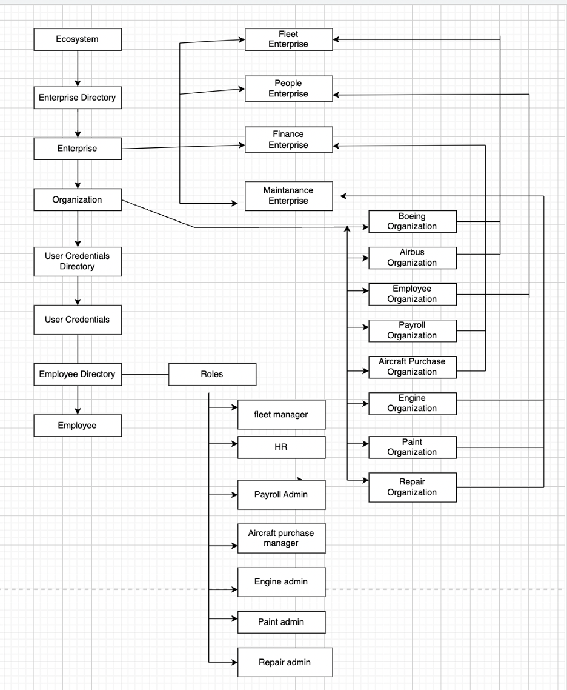
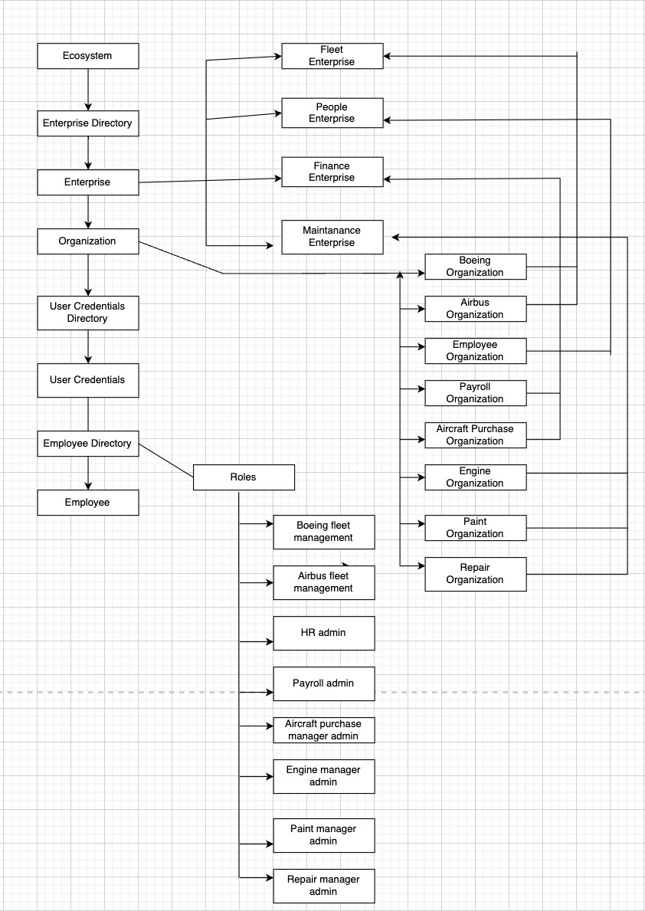

### Airline-Management-System

#### Purpose :
The application manages the airline data such as fleet, Employee management, airline finance and Maintainance.

##### Details about Enterprises and Organizations are listed below

- Airline: Manages the airline
 - Organization- Boeing and Airbus.  admin: fleet manager
 - In Boeing and Airbus- 
		Features like CRUD is applied. After Login, All aircraft will be listed in the fleet manager's system. There will be produced a list of all trips.
		To view or change trip details, the fleet manager will click on the trip.
		The fleet manager can create the airline's schedule, add or remove aircraft, and change the relevant flight information.
		The fleet manager has the ability to order new engines and send planes in for repairs.

- People: Manages an airline employees
 - Organization- Employee. admin: HR
 - In Employee management
 Features like CRUD is applied. After Login, All employees will be listed.
        HR is able to update, delete, and add employees.
        A list of all the employees under that management will be generated.
        The ability to search by email has been implemented, and it will display any records of matched email.

- Finance:
	- Organization- Payroll and Aircraft Purchase
	- Finance Portal contains 2 Admins: Payroll Manager and Aircraft Purchase Manager
	
      	  HR is able to update, delete, and add employees
      	  In Payroll: Features like CRUD on Allowances, Deductions and Payroll generation have been implemented. 
			All the validations have been implemented.
			Mapping and Unmapping of Allowances and Deductions to Employees have also been done.
			Aircraft Purchase Manager: The Aircraft Purchase Manager can add the list of requirements to the DB, and perform other CRUD Operations. He can also purchase the items from the store. The total bill generated is dynamic. Purchase order history is also part of the feature of the Airline Purchase portal.
			The manager can also download the bill (feature to be implemented)

- Maintainance:
 - Organization- Engine, Paint and Repair
 - Maintainance Portal contains 3 admins: Engine manager, Paint manager and repair manager.
		In Engine- Features like CRUD is applied. Once Engine manager logs in, can read/view all orders placed for that engine for a certain aircraft as well as the date of the order's purchase. 
		He can add new order, can delete order and can update the status of the order (i.e can check if parts has been delivered or its placed)
		In Paint- Once Paint manager logs in he can view the request for the aircraft, the color that has to be painted on it, and the deadline for doing so. 
		He has the ability to add the details, update the progress of the work being done, and delete the job.
		In Repair- Once Repair manager logs in, he can view details of all the aircraft for which repairs has been requested.
		He can view the components that need to be fixed or replaced before the deadline.
		He has the ability to delete, update, and add new aircraft to the repair queue.

#### Class Diagram

#### Object Diagram

